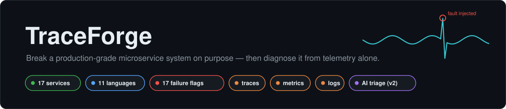
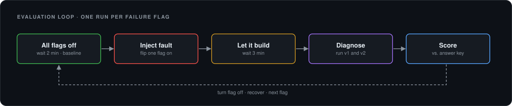
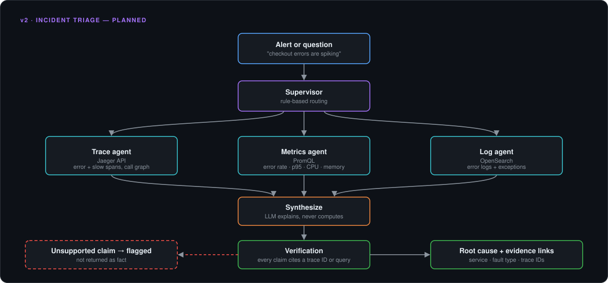
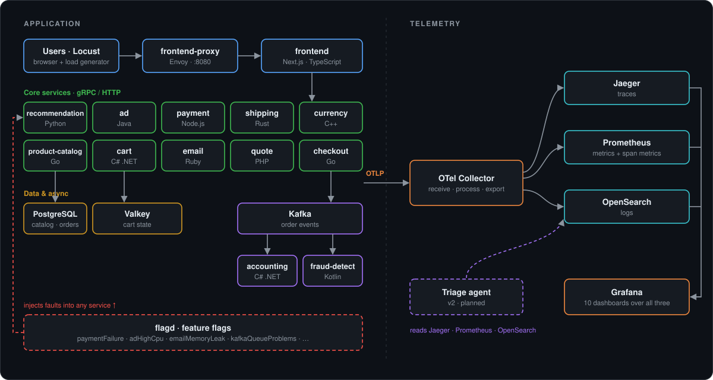

# 🔭 TraceForge




> **Attribution.** TraceForge is a fork of the
> [OpenTelemetry Demo (Astronomy Shop)](https://github.com/open-telemetry/opentelemetry-demo),
> © The OpenTelemetry Authors, Apache 2.0. The base system — the services,
> instrumentation and observability stack — is upstream work. What this fork
> adds is listed in [🧠 v2 — The Triage Layer](#-v2--the-triage-layer) and
> [🔀 What's Mine vs Upstream](#-whats-mine-vs-upstream). The original README is
> kept in [README.upstream.md](./README.upstream.md).

---

## 📊 v1 vs v2 — Measured

v1 is a **golden-signals baseline**: it reads per-service error rate and p95
latency from Prometheus — what a standard RED dashboard shows an on-call
engineer — and blames whichever service moved most. v2 is the **triage agent**:
metrics, trace and log specialists, an evidence ranking, an LLM-written
explanation, and a verification pass. Both were run against the same injected
faults, one flagd flag at a time, and asked "what's broken?" 60, 120 and 240
seconds after injection.



| Metric | v1 (golden-signals baseline) | v2 (triage agent) |
| --- | --- | --- |
| Root-cause service correctly identified | 5/12 | **8/12** |
| Fault type correctly identified | 4/12 | **7/12** |
| Time from fault injection to diagnosis | 120 s median (5/12 diagnosed) | **80 s** median (8/12 diagnosed) |
| Answers citing a specific trace / metric | n/a — v1 cites nothing | 3/12 verified (3/12 cite a trace ID) |

Per fault (answer at 240 s):

| Flag | Expected | v1 | v2 |
| --- | --- | --- | --- |
| `paymentFailure` | payment · errors | checkout / errors ❌ | payment / errors ✅ |
| `paymentUnreachable` | payment · errors | checkout / errors ❌ | payment / errors ✅ |
| `cartFailure` | cart · errors | nothing found ❌ | nothing found ❌ |
| `adFailure` | ad · errors | ad / errors ✅ | ad / errors ✅ |
| `productCatalogLockContention` | product-catalog or DB · latency | recommendation / latency ❌ | recommendation / latency ❌ |
| `intlShippingSlowdown` | shipping · latency | shipping / latency ✅ | shipping / latency ✅ |
| `adHighCpu` | ad · cpu | shipping / latency ❌ | payment / memory ❌ |
| `adManualGc` | ad · latency or cpu | ad / latency ✅ | ad / latency ✅ |
| `kafkaQueueProblems` | kafka or a consumer · queue | fraud-detection / latency 🟡 | fraud-detection / latency 🟡 |
| `loadGeneratorFloodHomepage` | frontend · traffic | nothing found ❌ | frontend / traffic ✅ |
| `recommendationCacheFailure` | recommendation · memory or latency | recommendation / latency ✅ | recommendation / memory ✅ |
| `emailMemoryLeak` | email · memory | nothing found ❌ | nothing found ❌ |

✅ service and fault type right · 🟡 service right, fault type wrong · ❌ wrong service

**Ablation — should the LLM pick the root cause?** Given the same evidence,
llama3.2 choosing the root cause itself also scores 8/12. The 3B model adds no
accuracy over the deterministic ranking, so it explains rather than decides.

### How to read these numbers honestly

- **12 faults is a small sample.** One more right answer moves a row by 8 points.
- **Dev/test overlap.** Most of v2's bugs were found by debugging the two payment
  faults, which are also in the benchmark. v2's payment results are partly on its
  own development data; the other 10 faults it had not been tuned on.
- **v2 wins mostly on two kinds of fault.** Errors that propagate (v1 blames
  `checkout`, which only *shows* payment's errors; v2 traces them to where they
  start) and traffic spikes (v1 doesn't look at request rate). On latency faults
  the two tie.
- **Time to diagnosis is coarse.** Answers are taken at 60 / 120 / 240 s, so
  "80 s" means v2 was usually right at the first check. v2's time includes 7–37 s
  of its own compute, mostly the LLM on CPU.
- **"Verified" is low because the check is stricter than the prompt.** The
  prompt asks the LLM to describe the effect on *other* services; the verifier
  rejects any citation not about the blamed service. 7 of the 9 failures are
  exactly that. The rule was not loosened after seeing results — see Known
  Limitations.
- **Two faults were re-run or dropped, not cherry-picked.** `emailMemoryLeak`
  is from a re-run because the laptop slept during the first one (it missed both
  times). `productCatalogFailure` is excluded: its flag has targeting rules that
  return "off" for every product, so the harness never actually injected it.
- Raw results: [`src/triage/results/final.json`](src/triage/results/final.json).
  Reproduce with [`src/triage/run_eval.py`](src/triage/README.md) (~90 min).

---

## 💡 What It Does

A realistic e-commerce system — storefront, cart, checkout, payment, shipping,
recommendations, ads, fraud detection — split across **15+ microservices in 11
languages**, every one instrumented with OpenTelemetry. All telemetry flows
through one OpenTelemetry Collector into Jaeger, Prometheus, OpenSearch and
Grafana.

The interesting part is the failure injection. Flip a feature flag and the system
breaks in a specific, realistic way:

> *"Payment fails 50% of the time."* *"The email service leaks memory."*
> *"Kafka consumers fall behind."* *"The product catalog DB hits lock contention."*

Then you diagnose it the way an SRE would — from the telemetry alone.

---

## 🧠 v2 — The Triage Layer

v1 makes the evidence available; a human still has to find it. When
`paymentFailure` is on, the cause is in Jaeger — but you have to know to filter
for error spans, follow them from `frontend` through `checkout` to `payment`, and
cross-check the error rate in Prometheus. v2 does that first pass automatically.
Code: [`src/triage/`](src/triage/).



| Agent | Reads | Finds |
| --- | --- | --- |
| Metrics | Prometheus (PromQL) | error ratio, p95 latency, CPU, memory, Kafka lag, request-rate spikes — baseline vs. fault window |
| Trace | Jaeger API | where errors **originate** (an error span with no failing child) and where time is **spent** (self-time per service) |
| Log | OpenSearch | error-log rate jumps per service, with a sample message |
| Verification | the evidence above | explanation names the blamed service, cites real evidence about it, and uses only numbers that appear in the evidence |

### Design decisions worth defending

**The evidence decides; the LLM explains.** Every number is computed in Python.
During development a 3B model, shown a correct ranking, overruled it in favour of
the service with the loudest symptom. The ablation above confirms it adds no
accuracy, so it writes the incident summary and nothing else.

**Error origin beats error volume.** Callers of a failing service show the same or
higher error ratios — that's exactly why v1 blames `checkout`. When traces show
where errors start, other services' error symptoms are treated as propagation.

**Counters are diffed, not `increase()`d.** Span metrics reach Prometheus about
once a minute, and an error counter only comes into existence with the first
error. `increase()` over a 1–2 minute window reads ≈0 for exactly the series that
matter; diffing the counter against its value at the window start (missing = 0)
doesn't.

**The newest 20 seconds of traces are ignored.** Services export spans in batches,
so a very recent trace is often missing its downstream half — and a half-arrived
trace looks like the caller failed on its own.

---

## 🏗️ Architecture



---

## 🛠️ Tech Stack

| Service | Language | Role |
| --- | --- | --- |
| 🛒 frontend | TypeScript (Next.js) | Storefront UI + server-side API |
| 🚪 frontend-proxy | Envoy | Single entry point, routes to all UIs |
| 💳 checkout | Go | Orchestrates the order flow |
| 📦 product-catalog | Go | Product data from PostgreSQL |
| 🛍️ cart | C# (.NET) | Cart state in Valkey |
| 💰 payment | JavaScript (Node.js) | Card charges |
| 🚚 shipping | Rust | Shipping quotes and tracking |
| 💱 currency | C++ | Currency conversion |
| ✉️ email | Ruby | Order confirmation emails |
| 🧾 quote | PHP | Shipping cost calculation |
| ⭐ recommendation | Python | Product recommendations |
| 📢 ad | Java | Contextual ads |
| 📊 accounting | C# (.NET) | Consumes orders from Kafka |
| 🕵️ fraud-detection | Kotlin | Consumes orders from Kafka |
| 🎚️ flagd + flagd-ui | Go / Elixir | Feature flags for fault injection |
| 🤖 agent, chatbot, mcp | Python (LangGraph) | AI shopping assistant + MCP server |
| 🐝 load-generator | Python (Locust) | Simulated user traffic |

| Layer | Technology |
| --- | --- |
| 📡 Telemetry pipeline | OpenTelemetry Collector |
| 🔍 Traces | Jaeger |
| 📈 Metrics | Prometheus |
| 📜 Logs | OpenSearch |
| 🖥️ Dashboards | Grafana — 10 provisioned dashboards (APM, span metrics, exemplars, PostgreSQL, collector self-monitoring, …) |
| 📨 Messaging | Kafka |
| 🗄️ Storage | PostgreSQL, Valkey |
| 🐳 Deployment | Docker Compose (Kubernetes via the upstream Helm chart) |

---

## 💥 Failure Scenarios

Every scenario is a flagd feature flag. Toggle it at
`http://localhost:8080/feature/` and the fault starts immediately.

| Flag | What breaks |
| --- | --- |
| `paymentFailure` | Payment charges fail n% of the time |
| `paymentUnreachable` | Payment service is unavailable |
| `cartFailure` | Cart service fails n% of the time |
| `failedReadinessProbe` | Cart readiness probe fails |
| `productCatalogFailure` | Product catalog fails on a specific product |
| `productCatalogLockContention` | Lock contention on the product catalog database |
| `recommendationCacheFailure` | Recommendation cache fails |
| `adFailure` | Ad service fails |
| `adHighCpu` | High CPU load in the ad service |
| `adManualGc` | Full manual garbage collections in the ad service |
| `emailMemoryLeak` | Memory leak in the email service |
| `kafkaQueueProblems` | Kafka queue overload + consumer delay → lag spike |
| `intlShippingSlowdown` | International shipping responses are delayed |
| `imageSlowLoad` | Frontend images load slowly |
| `loadGeneratorFloodHomepage` | Floods the frontend with requests |
| `aiSlowResponse` | Slow LLM responses in the agent service |
| `aiRunawayAgent` | Agent loops tool calls until its recursion limit |

---

## ⚡ Quick Start

### Prerequisites

- Docker Desktop (or Docker Engine + Compose v2)
- **6 GB RAM** allocated to Docker minimum

### 1 — Clone

```bash
git clone https://github.com/Khushipatel27/traceforge.git
cd traceforge
```

### 2 — Launch

```bash
make start            # full stack
make start-minimal    # fewer services, lighter on RAM
make start-agentic    # full stack + AI agent, chatbot and MCP server
```

Without `make` (e.g. on Windows):

```bash
docker compose --env-file .env --env-file .env.override -f compose.yaml -f compose.full.yaml -f compose.observability.yaml -f compose.extras.yaml up --force-recreate --remove-orphans --detach
```

### 3 — Open

| UI | URL |
| --- | --- |
| 🛒 Storefront | <http://localhost:8080> |
| 🖥️ Grafana | <http://localhost:8080/grafana/> |
| 🔍 Jaeger | <http://localhost:8080/jaeger/ui/> |
| 🎚️ Feature flags | <http://localhost:8080/feature/> |
| 🐝 Load generator | <http://localhost:8080/loadgen/> |

### 4 — Break something

1. Open the feature flag UI and turn on `paymentFailure`.
2. Wait a minute for the load generator to place orders.
3. In Jaeger, search service `checkout` with tag `error=true` and follow the span into `payment`.
4. In Grafana, open the span metrics dashboard and watch the payment error rate climb.

Stop everything with `make stop`.

---

## 📸 Screenshots

<!--
Screenshots go in docs/images/screenshots/. Take them once the stack is running,
then delete this comment wrapper so the table renders.

| Storefront | Jaeger trace during paymentFailure |
| --- | --- |
|  |  |
| **Grafana span metrics** | **Feature flag UI** |
|  |  |
-->

*Screenshots coming once the stack is running locally.*

---

## 🧪 Testing

Telemetry sanity tests run in a Dockerized pytest container on the same network
as the stack, and query the backends directly to check that every service is
producing telemetry.

| Test file | Checks |
| --- | --- |
| `test_traces.py` | Each service emits traces to Jaeger |
| `test_traces_edges.py` | Expected service-to-service call edges exist |
| `test_metrics.py` | Each service emits metrics to Prometheus |
| `test_logs.py` | Each service emits logs to OpenSearch |
| `test_collector.py` | The collector pipeline itself is healthy |
| `test_agentic.py` | AI agent / MCP telemetry |

```bash
make run-telemetry-tests            # full stack
make run-telemetry-tests-minimal    # minimal stack
make run-frontend-tests             # Cypress end-to-end tests for the storefront
```

### Triage benchmark (v1 vs v2)

Needs the stack running with `LOCUST_USERS=20` (already set in `.env.override`)
and [Ollama](https://ollama.com) serving `llama3.2` on the host. Keep the
machine awake: a sleep leaves holes in the telemetry.

```bash
ollama pull llama3.2
docker run --rm --network opentelemetry-demo -v "$PWD:/repo" -w /repo/src/triage \
  python:3.12-slim python run_eval.py      # ~90 min, writes src/triage/results/
```

See [src/triage/README.md](src/triage/README.md) for running a subset of faults.

---

## 🔀 What's Mine vs Upstream

| Area | Source |
| --- | --- |
| Microservices, instrumentation, collector config, dashboards, failure flags, tests | Upstream (OpenTelemetry Authors) |
| TraceForge branding, this README | This fork |
| Incident-triage agent (v2): metrics, trace and log agents, ranking, verification | This fork — [`src/triage/`](src/triage/) |
| Golden-signals baseline (v1) and the fault-injection benchmark | This fork — [`src/triage/run_eval.py`](src/triage/run_eval.py) |
| Load raised to 20 simulated users | This fork — `.env.override` |

---

## ⚠️ Known Limitations

- **Heavy.** The full stack runs 20+ containers; under 6 GB of Docker RAM,
  services get OOM-killed and the telemetry looks like a failure that isn't one.
- **Simulated traffic.** Load comes from Locust, so traffic patterns are
  regular in a way real users aren't. Anomalies stand out more cleanly than they
  would in production.
- **One fault at a time.** The flags are designed to be tested individually;
  combining them produces overlapping symptoms that are hard to attribute.

Stated plainly, because knowing where the triage agent breaks is part of having built it:

- **Resource faults get outranked by noise.** On `adHighCpu`, v2 *did* measure
  `ad` going from 2.8 to 6.3 CPU cores, but ranked it third behind small memory
  and latency shifts elsewhere. Scores from different signal types aren't on a
  comparable scale yet.
- **Slow leaks fall under the thresholds.** `emailMemoryLeak` grew email's memory
  from 70 MB to 95 MB in four minutes, under the +30 MB alarm. A leak needs a
  growth-*rate* check over a longer window, not a before/after delta.
- **Quiet faults are invisible.** `cartFailure` only breaks `EmptyCart`, called
  once per completed order, so it never produced enough errors to clear the
  noise floor for either version.
- **Database contention looks like everyone's fault.** Under
  `productCatalogLockContention` every caller hit the same 15 s timeout, and the
  service with the biggest p95 jump (`recommendation`) won. v2's trace agent saw
  the database self-time rise (1 ms → 4.2 s) and ranked it a close second.
- **Fault type for queues.** `kafkaQueueProblems` was traced to the right consumer
  (`fraud-detection`) but labelled latency, not queue lag: the lag metric is only
  exported by that one consumer and moved less than its latency.
- **The verifier contradicts the prompt.** The explanation prompt asks for the
  effect on other services; the verifier rejects citations about any service but
  the blamed one. That's why only 3/12 explanations verify. The fix is to require
  *at least one* citation about the blamed service rather than *only* those.
- **The LLM runs on CPU.** Ollama doesn't use the laptop GPU here, so each
  explanation costs 7–37 s and slightly loads the system being diagnosed.

---

## 🔮 Future Improvements

- [x] Incident-triage agent — trace, metrics and log specialists + verification
- [x] Reproducible fault-injection benchmark (one run per flag)
- [ ] Normalise scores across signal types so CPU/memory faults aren't outranked by latency noise
- [ ] Growth-rate detection for slow memory leaks
- [ ] Align verifier and prompt (allow citations about affected services) and re-measure
- [ ] Inject `productCatalogFailure` through its targeting rule and add it back
- [ ] Repeat the benchmark 3× and report variance
- [ ] SLO dashboard with error-budget burn-rate alerts per service
- [ ] Alertmanager → triage agent hook, so diagnosis starts on alert
- [ ] Written inject → detect → diagnose walkthroughs for each failure flag

---

## 📄 License

Apache License 2.0 — see [LICENSE](./LICENSE). Original source files keep their
`Copyright The OpenTelemetry Authors` headers.

*Built to learn observability the way it's practised in production: by breaking things and reading the telemetry.*
